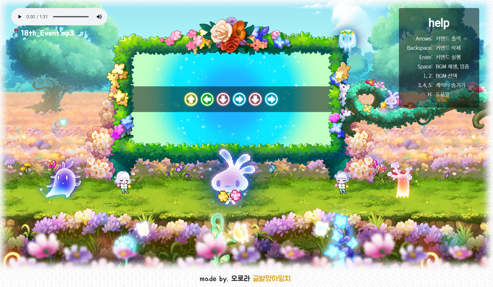
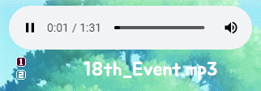
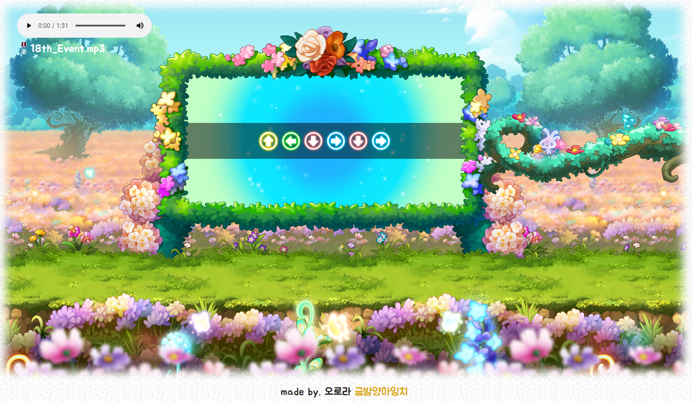

# maplestory_blooming_dance_party
## 블루밍 댄스 파티
</img><br>
메이플 18주년 이벤트 블루밍 포레스트의 번외 코인 수급 이벤트<br>
:musical_note:**블루밍 댄스파티**:musical_note:를 더욱 즐길 수 있는 토이 프로젝트입니다.
<br><br>
## 기능1) 커맨드 메모

이 프로젝트는 기본적으로 강력한 **커맨드 메모 기능**을 지원합니다.<br>
더 이상 암기의 스트레스 없이 블루밍 댄스파티 자체를 즐겨보세요! :laughing:
## 기능2) 커맨드 지우기, 비우기(실행)
<br>
커맨드를 잘못 입력하셨다구요?<br>
**Backspace**로 간단히 입력을 취소하세요.<br>
다음 커맨드를 입력하려면 간단히 **Enter**키를 눌러 입력창을 비워주세요.<br>
더불어 조그만 정령이 입력된 커맨드에 따라 춤추는 것도 구경하실 수 있습니다!!<br><br>
```diff
# p.s. 커맨드는 10개 이하로 입력할 수 있습니다.
# p.p.s. 6개 이상의 커맨드를 입력 시 조그만 정령이 더 빠르게 춤을 춥니다.
# p.p.p.s. 춤을 추는 도중에도 커맨드를 입력 받을 수 있습니다.
# p.p.p.p.s 커맨드 입력시 다른 정령 친구들도 특별한 춤을 춥니다!
```
## 기능3) BGM
<br>
적막함을 달래줄 2개의 BGM도 준비가 되어있습니다!<br>
**숫자 1, 2번**으로 곡을 선택하고,<br>
언제든 **Spacebar**를 통해 곡을 재생하세요!<br>
## 기능4) 캐릭터 숨기기
</img><br>
커맨드 메모 기능만 이용하고 싶은데 춤추는 캐릭터들이 너무 어지러우시다구요?<br>
**숫자 3, 4, 5번**키를 사용해 원하지 않는 캐릭터 애니메이션은 물론<br>
**H**키를 이용해 도움말까지 감출 수 있습니다!<br>
***
<br>
그럼 이제 신나게 블루밍 댄스 파티를 즐겨주세요!
